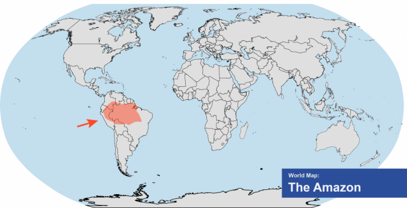

```{r setup, include=FALSE}
knitr::opts_chunk$set(echo = TRUE)

# Note to user: Please ensure that the following packages have been installed prior to running the code.
# Packages can be installed using the command "install.packages('name_of_package')".
# Packages used.
library(dplyr)
library(forcats)
library(ggplot2)
library(ggthemes)
library(highcharter)
library(readxl)
library(scales)
library(shiny)
library(shinythemes)
library(scales)
library(tidyr)


# Empty Shiny App template. 
# ui <- fluidPage("")
# server <- function(input, output) {}
# shinyApp(ui = ui, server = server)
```

<!-- Part 1 -->
## Climate Change & CO^2^ 101
<!-- <<<<<<< HEAD -->
What is climate change?
According to NASA, climate change is a long-term change in the average weather patterns that have come to define Earth’s local, regional and global climates. These changes have a broad range of observed effects that are synonymous with the term.Changes observed in Earth’s climate since the early 20th century are primarily driven by human activities, particularly fossil fuel burning, which increases heat-trapping greenhouse gas levels in Earth’s atmosphere, raising Earth’s average surface temperature. These human-produced temperature increases are commonly referred to as global warming. Natural processes can also contribute to climate change, including internal variability (e.g., cyclical ocean patterns like El Niño, La Niña and the Pacific Decadal Oscillation) and external forcings (e.g., volcanic activity, changes in the Sun’s energy output, variations in Earth’s orbit)

A significant proportion of these emissions comes from just transportation!

```{r echo=FALSE, figures-side, fig.show="hold", out.width="50%"}
par(mar = c(4, 4, .1, .1))
data <- read_excel("Data/global emission.1.xlsx") 
df <- data.frame( 
  x= data$`Sub-sector`,
  y=data$`Share of global greenhouse gas emissions (%)`) 


transport <- read_excel("Data/global emission.3.xlsx")
df_transport <- transport %>% slice(1:5)
df_transport <- data.frame( 
  x= df_transport$`Sub-sector`,
  y=df_transport$`Share of global greenhouse gas emissions (%)`) 

# Set highcharter options 
options(highcharter.theme = hc_theme_smpl(tooltip = list(valueDecimals = 2))) 

# prduce the interactive piechart 
total_pie <- highchart () %>% 
  hc_add_series(
    df, 
    "pie",
    hcaes(
      x = x,
      y = y,
      ),
    name = "CO2 emissions by %"
    )  %>%
  hc_plotOptions(
    series = list(
      showInLegend = FALSE,
      pointFormat = "{point.y}%",
      colorByPoint = TRUE
      )) %>%
  hc_title(
    text = "Total Global CO2 Emissions in 2016"
    ) 

# pie chart for transportation categories 
transport_pie <- highchart () %>% 
  hc_add_series(
    df_transport, 
    "pie",
    hcaes(
      x = x,
      y = y,
      ),
    name = "CO2 emissions by %"
    )  %>%
  hc_plotOptions(
    series = list(
      showInLegend = FALSE,
      pointFormat = "{point.y}%",
      colorByPoint = TRUE
      )) %>%
  hc_title(
    text = "Global CO2 Emissions from Transportation Types in 2016"
    ) 

total_pie
transport_pie

```

Many people own cars in Canada. Did you know that the average Canadian vehicle, which burns 2 000 L of gasoline every year, releases about 4 600 kg of CO2 into the atmosphere (according to Natural Resources Canada)? 
This number might not mean much to you. So let's see how many trees are working to absorb our emissions. 
According to US Department of Agriculture, in one year a mature tree will absorb more than 48 pounds (roughly 22 kg) of CO2 from the atmosphere and release oxygen in exchange.  


209 trees work to absorb just 1 average vehicle's CO2 emissions.
Globally we produced 5.7 billion tonnes of CO2 from only transportation in 2016. To absorb this from the atmosphere, we need 259 billion trees. World's largest forest Amazon rain forest roughly have 390 billion trees. We would need about 66% of the trees in Amazon to absorb the CO2 emissions produced only from transportation. 




=======

<!-- Part 2 -->
## Unsustainable CO^2^ Emissions
|
|       With the improvement of technology, rise in human population, and the growth of industry, CO^2^ emissions are rising rapidly. In 2019 alone, annual production-based CO^2^ emissions reached over **36 billion tonnes**, an increase of about 15.8% just a decade ago and over 60.5% since 1990. At current levels, CO^2^ emissions are unsustainable for the environment and if we do not reverse the trend soon, we risk causing irreparable harm to the world we live in.
|
|       Perhaps one positive thing that came out of the global financial crisis of 2008 was that annual CO^2^ emissions fell for the first time in many years. One possible explanation is that due to the recession, less people were able to afford buying or using vehicles for transportation causing less vehicles to be on the road and therefore, less CO^2^ to be emitted. This relationship can be seen in the following plots where both annual vehicle production and CO^2^ emissions fell during said period. There appears to be a similar trend happening with the current global COVID-19 pandemic where annual vehicle productions fell drastically while CO^2^ emissions appear to stagnate in this time period. One thing is for certain, less (conventional) vehicles on the road means less CO^2^ emissions.
|
|       That being said, relying on disastrous events to curb global warming is not ideal! We have to change our thinking and lifestyles if we want a healthy planet for our future generations. With technological advancements, "greener" alternatives of transportation and energy production are becoming readily available and more cost efficient. Countries as well as individuals are jumping on the "green" bandwagon as the effects of global warming become more and more pronounced. It is a step in the right direction but is it too little too late? Find out how well your country has been doing with respect to CO^2^ emissions using the interactive plot below!
&nbsp; <!-- blank line -->

```{r part2 setup, include=FALSE}
# Data for emissions.
p2_emissions_data <- read.csv("Data/owid-co2-data.csv")

# Data Exploration.
# 2019 CO2 emissions.
c19 <- p2_emissions_data[which(p2_emissions_data$country == "World" & p2_emissions_data$year == 2019), c("co2")]
c19
# 2009 CO2 emissions.
c09 <- p2_emissions_data[which(p2_emissions_data$country == "World" & p2_emissions_data$year == 2009), c("co2")]
c09
# 1990 CO2 emissions.
c90 <- p2_emissions_data[which(p2_emissions_data$country == "World" & p2_emissions_data$year == 1990), c("co2")]
c90
# Y-o-Y growth.
(c19/ c09) - 1
(c19/ c90) - 1

# Clean data.
p2_emissions_clean <- p2_emissions_data[c("country", "year", "co2", "cumulative_co2", "gas_co2", "cumulative_gas_co2")]

# Data for production.
p2_production_data <- read_excel("Data/production.xlsx")
p2_production_clean <- p2_production_data %>%
  pivot_longer(-c(year), names_to = "Type", values_to = "count") %>% 
  mutate(Type = fct_relevel(Type, "Total Vehicle", after = 2)) %>% 
  group_by(Type) %>%
  filter(year < 2020)

part2_widget = function(emissions_data, production_data) {
  
  shinyApp(
    ui = fluidPage(
      theme = shinytheme("cosmo"),
      
      fluidRow(
        # Plot output for emissions.
        column(6, plotOutput("emissions")),
        
        # Plot output for production.
        column(6, plotOutput("production"))
      ),
      
      fluidRow(
        # Type selector for emissions.
        column(3, radioButtons(
          inputId = "type",
          label = "Type:",
          choices = list("Show All" = "Show All", "Total" = "Total", "Gas" = "Gas"),
          selected = "Show All",
          inline = TRUE)),
        
        # View selector for emissions.
        column(3, radioButtons(
          inputId = "view",
          label = "View:",
          choices = list("Annual" = "Annual", "Cumulative" = "Cumulative"),
          selected = "Annual",
          inline = TRUE)),
        
        # View selector for production.
        column(6, radioButtons(
          inputId = "vehicle_type",
          label = "Type:",
          choices = list("Show All" = "Show All", "Total" = "Total", "Commercial" = "Commercial", "Cars"= "Cars"),
          selected = "Show All",
          inline = TRUE))
      ),
      
      fluidRow(
        # # Show both for comparison selector for emissions.
        # column(3, checkboxInput(
        #   inputId = "showBoth",
        #   label = "Show Both (For Comparison)",
        #   value = TRUE
        # )),
        
        # Country selector for emissions.
        column(6, selectInput(
          inputId = "country",
          label = "Country:",
          choices = unique(emissions_data$country),
          selected = "World",
          width = "95%"),
        ),
        
        # # Show both for comparison selector for production.
        # column(3, checkboxInput(
        #   inputId = "showAll",
        #   label = "Show All (For Comparison)",
        #   value = TRUE
        # )),
        
        column(6, )
      ),
      
      # Year range slider widget.
      fluidRow(
        column(6, sliderInput(
          inputId = "years",
          label = "Year Range:",
          # Even though data since 1751 was provided, show data starting from 1900s.
          min = 1900,
          max = 2019,
          value = c(2000, 2019),
          step = 1,
          width = "100%",
          sep = "",
          dragRange = TRUE)),
        column(6, ))
    ),

    server = function(input, output, session) {
      
      # Emissions.
      # Put together dataset based on user selections.
      selected_emissions_data <- reactive({
        # Annual.
        if (input$view == "Annual") {
          emissions_data %>%
            filter(country == input$country) %>%
            group_by(year) %>%
            filter(year >= input$years[1] & year <= input$years[2]) %>%
            summarise(Total = sum(co2, na.rm = TRUE),
                      Gas = sum(gas_co2, na.rm = TRUE))
        }
        
        # Cumulative.
        else {
          emissions_data %>%
            filter(country == input$country) %>%
            group_by(year) %>%
            filter(year >= input$years[1] & year <= input$years[2]) %>%
            summarise(Total = sum(cumulative_co2, na.rm = TRUE),
                      Gas = sum(cumulative_gas_co2, na.rm = TRUE))
        }
      })
      
      # Put together plot based on user selections.
      selected_emissions_plot <- reactive({
        # Show both.
        if (input$type == "Show All") {
          ggplot(selected_emissions_data(), aes(x = year)) +
            geom_point(aes(y = Total, colour = "Total")) +
            geom_point(aes(y = Gas, colour = "Gas")) +
            geom_path(aes(y = Total, colour = "Total")) +
            geom_path(aes(y = Gas, colour = "Gas")) +
            geom_rect(data = emissions_data[1, ],
                      aes(xmin = 2007.5, xmax = 2009.5, ymin = 0, ymax = Inf), alpha = 0.25, fill = "red") +
            geom_text(data = emissions_data[1, ],
                      aes(x = 2008.5, y = max(selected_emissions_data()$Total * 0.45), label = "Financial Crisis"), size = 3) +
            geom_rect(data = emissions_data[1, ],
                      aes(xmin = 2018.5, xmax = 2020, ymin = 0, ymax = Inf), alpha = 0.25, fill = "red") +
            geom_text(data = emissions_data[1, ],
                      aes(x = 2019.25, y = max(selected_emissions_data()$Total * 0.65), label = "COVID-19"), size = 3) +
            scale_color_manual("",
                               breaks = c("Total", "Gas"),
                               values = c("#d95f02", "#7570b3")) +
            xlim(min(selected_emissions_data()$year), max(selected_emissions_data()$year) + 1) +
            labs(title = paste(input$view, "Carbon Dioxide Emissions"),
                 x = "Year",
                 y = expression(paste("CO"^"2", " Emissions (million tonnes)")),
                 caption = "Data source: https://github.com/owid/co2-data") +
            theme_wsj() + 
            theme(plot.title = element_text(size = rel(0.65), hjust = 0.5),
                  plot.caption = element_text(size = rel(0.35)),
                  axis.title = element_text(size = rel(0.5)),
                  legend.position = "top",
                  legend.justification = "center")
        }
        # Show one.
        else {
          ggplot(selected_emissions_data(), aes(x = year)) +
            geom_point(aes_string(y = input$type)) +
            geom_path(aes_string(y = input$type)) +
            geom_rect(data = emissions_data[1, ],
                      aes(xmin = 2007.5, xmax = 2009.5, ymin = min(selected_emissions_data()[[input$type]]) * 0.95, ymax = Inf), alpha = 0.25, fill = "red") +
            geom_text(data = emissions_data[1, ],
                      aes(x = 2008.5, y = min(selected_emissions_data()[[input$type]] * 1.05), label = "Financial Crisis"), size = 3) +
            geom_rect(data = emissions_data[1, ],
                      aes(xmin = 2018.5, xmax = 2020, ymin = min(selected_emissions_data()[[input$type]]) * 0.95, ymax = Inf), alpha = 0.25, fill = "red") +
            geom_text(data = emissions_data[1, ],
                      aes(x = 2019.25, y = min(selected_emissions_data()[[input$type]] * 1.15), label = "COVID-19"), size = 3) +
            xlim(min(selected_emissions_data()$year), max(selected_emissions_data()$year) + 1) +
            ylim(min(selected_emissions_data()[[input$type]]) * 0.95, max(selected_emissions_data()[[input$type]]) * 1.05) +
            labs(title = paste(input$view, "Carbon Dioxide Emissions"),
                 subtitle = paste(input$type),
                 x = "Year",
                 y = expression(paste("CO"^"2", " Emissions (million tonnes)")),
                 caption = "Data source: https://github.com/owid/co2-data") +
            theme_wsj() +
            theme(plot.title = element_text(size = rel(0.65), hjust = 0.5),
                  plot.subtitle = element_text(size = rel(0.5), hjust = 0.5),
                  plot.caption = element_text(size = rel(0.35)),
                  axis.title = element_text(size = rel(0.5)))
        }
      })

      # Emissions plot.
      output$emissions <- renderPlot({selected_emissions_plot()})
      
      # Production
      # Put together dataset based on user selections.
      selected_production_data <- reactive({
        if (input$vehicle_type == "Total"){
          production_data %>% 
            filter(Type == "Total Vehicle") %>%
            mutate(count = count/1000000)
        } else if (input$vehicle_type == "Commercial"){
          production_data %>% 
            filter(Type == "Commercial") %>%
            mutate(count = count/1000000)
        } else {
          production_data %>% 
            filter(Type == "Cars") %>%
            mutate(count = count/1000000) 
        }
      })
      
      # Put together plot based on user selections.
      selected_production_plot <- reactive({
        # Show all.
        if (input$vehicle_type == "Show All") {
          ggplot(production_data, aes(x = year, y = count / 1000000, colour = Type)) +
            geom_point() +
            geom_path() +
            geom_rect(data = production_data[1, ],
                      aes(xmin = 2007.5, xmax = 2009.5, ymin = 0, ymax = Inf), alpha = 0.25, fill = "red", color = NA) +
            geom_text(data = production_data[1, ],
                      aes(x = 2008.5, y = max(production_data$count / 1000000 * 0.45), label = "Financial Crisis"), size = 3, color = "black") +
            geom_rect(data = production_data[1, ],
                      aes(xmin = 2018.5, xmax = 2020, ymin = 0, ymax = Inf), alpha = 0.25, fill = "red", color = NA) +
            geom_text(data = production_data[1, ],
                      aes(x = 2019.25, y = max(production_data$count / 1000000 * 0.65), label = "COVID-19"), size = 3, color = "black") +
            scale_color_manual("",
                               breaks = c("Commercial", "Total Vehicle", "Cars"),
                               values = c("#1b9e77", "#d95f02", "#7570b3")) +
            xlim(2000, 2020) +
            labs(title = "Annual Vehicle Production",
                 x = "Year",
                 y = "Vehicles Produced (millions)",
                 caption = "Data source: https://www.oica.net/category/production-statistics/") +
            theme_wsj() + 
            theme(plot.title = element_text(size = rel(0.65), hjust = 0.5),
                  plot.caption = element_text(size = rel(0.35)),
                  axis.title = element_text(size = rel(0.5)),
                  legend.position = "top",
                  legend.justification = "center")
        }
        # Show one.
        else {
          ggplot(selected_production_data(), aes(x = year, y = count)) +
            geom_point() +
            geom_path() +
            geom_rect(data = production_data[1, ],
                      aes(xmin = 2007.5, xmax = 2009.5, ymin = min(selected_production_data()$count) * 0.95, ymax = Inf), alpha = 0.25, fill = "red", color = NA) +
            geom_text(data = production_data[1, ],
                      aes(x = 2008.5, y = min(selected_production_data()$count * 1.05), label = "Financial Crisis"), size = 3, color = "black") +
            geom_rect(data = production_data[1, ],
                      aes(xmin = 2018.5, xmax = 2020, ymin = min(selected_production_data()$count) * 0.95, ymax = Inf), alpha = 0.25, fill = "red", color = NA) +
            geom_text(data = production_data[1, ],
                      aes(x = 2019.25, y = min(selected_production_data()$count * 1.15), label = "COVID-19"), size = 3, color = "black") +
            xlim(2000, 2020) +
            ylim(min(selected_production_data()$count) * 0.95, max(selected_production_data()$count) * 1.05) +
            labs(title = "Annual Vehicle Production",
                 subtitle = paste(input$vehicle_type),
                 x = "Year",
                 y = "Vehicles Produced (millions)",
                 caption = "Data source: https://www.oica.net/category/production-statistics/") +
            theme_wsj() +
            theme(plot.title = element_text(size = rel(0.65), hjust = 0.5),
                  plot.subtitle = element_text(size = rel(0.5), hjust = 0.5),
                  plot.caption = element_text(size = rel(0.35)),
                  axis.title = element_text(size = rel(0.5)))
        }
      })
      
      # Production plot.
      output$production <- renderPlot({selected_production_plot()})
    },

    # Resize widget so that it fits on the page (instead of vertical scroll).
    options = list(height = 700)
  )
}
```

```{r part2, echo=FALSE}
# Run the widget for part 2.
part2_widget(p2_emissions_clean, p2_production_clean)
```

<!-- Part 3 -->
## What's your "Contribution"?
|
|       Let’s conduct a survey on what type of vehicle you use in your daily life and how far you guys will commute every day on average to see the level of Co2 emissions you release. There is a slider bar which can be used to input the distance and there are multiple choices of various types of vehicle in this second question of the survey. You can only make one choice in this part, since we want to see the Co2 emissions related to the primary vehicles you use in your daily life.
|
|       Based on the CO2 emissions per passenger per kilometer data, we can easily calculate the CO2 emission level they release by multiplying the CO2 emission of various vehicles per kilometer by the distance you input. You can also see the total CO2 emissions you release. You can change the choices of primary vehicles and distance, the result will be changed.
|
|       The result will also be reflected on the interactive visualization. There are several chimneys at the bottom of the survey. And there is smoke with different color hues which are red from the darkest to the lightest to stand for different levels of the CO2 emission levels from the highest to the lowest. If CO2 emissions are less than 2500g, then it corresponds to extremely low level; if CO2 emissions are greater than 2500g and less than 5000g, which means low level; for CO2 greater than 5000g and less than 7500g, the level will be medium; if the results are greater than 7500g and less than 10000g, it will denote high level; finally, if CO2 emissions are greater than 10000g, the result will be regarded as extremely high level of emissions.
|
```{r echo=FALSE}
ui <- fluidPage(
  fluidRow(
    sliderInput("distance", "How far do you travel every day on average? (km)",min = 0, max = 250, value = 125),
  ),
  
  fluidRow(
    radioButtons(
          inputId = "choice",
          label = "What type of primary vehicle do you use?:",
          choices = list("Car" = 1, "Train" = 2,"Plane" = 3, "Motorcycle" = 4, "Bus" = 5, "Subway" = 6, "Bicycle" = 7), 
          inline = TRUE)
    ),

   fluidRow(
     textOutput("word"),
     textOutput("calculation"),
     ),
  
  fluidRow(
    imageOutput("factory"),
    ),
)

server <- function(input, output, session) {
  result <- reactive({
    if (input$choice == 1) {
            co2emission2 = 171 *input$distance
    }
    else if (input$choice == 2){
            co2emission2 = 41 * input$distance
    }
    else if (input$choice == 3){
      co2emission2 = 133 * input$distance
    }
     else if (input$choice == 4){
      co2emission2 = 103 * input$distance
     }
     else if (input$choice == 5){
      co2emission2 = 105 * input$distance
     }
     else if (input$choice == 6){
      co2emission2 = 6 * input$distance
     }
     else if (input$choice == 7){
      co2emission2 = 0 * input$distance
    }
      })


  output$word <- renderText({"The total CO2 emission (g) is:"})
  output$calculation <- renderText({print(result())
    })
  output$factory <- renderImage({
    if(result() <= 2500){
      return(list(
        src = "www/extremely low.png",
        fileType = "image/png",
        alt = "exlow"
      ))
    }
    if(result() <= 5000){
      return(list(
        src = "www/low.png",
        fileType = "image/png",
        alt = "low"
      ))
    }
    else if(result() <=7500){
      return(list(
        src = "www/medium.png",
        fileType = "image/png",
        alt = "medium"
      ))
    }
    else if(result() <= 10000){
      return(list(
        src = "www/high.png",
        fileType = "image/png",
        alt = "high"
      ))
    }
    else if(result() > 10000){
      return(list(
        src = "www/extremely high.png",
        fileType = "image/png",
        alt = "exhigh"
      ))
    }
    },deleteFile = FALSE)
}
shinyApp(ui, server, options = list(height = 700)) # Change this to resize widget.

```

|       Based on the CO2 emissions per passenger per kilometer data, we can also find out that the impact of choosing alternative means of transport. Also, you can compare all types of vehicles with the following graph. The different color hues to represent categorical attributes – types of primary vehicles. The slope of each line will be the amount of the CO2 emission per person per kilometer release with one type of vehicle. From the visualization, you can see the total CO2 emissions you release if you choose different vehicle to daily commute 1 kilometer for 5 years. We can obviously see the difference among various types of vehicles along with the time. This can reflect the impacts on choosing alternative means of transport.

```{r echo=FALSE}
#the CO2 emission per kilometer for various types of cars
car_index <- 171
train_index <- 41
flight_index <- 133
motorcycle_index <- 103
bus_index <- 105
subway_index <- 6
bike_index <- 0

#calculate the CO2 emission for each vehicle
time = c(2021,2022,2023,2024,2025)
CO2_emission_car <- car_index*(time - 2021)*365
CO2_emission_train <- train_index*(time - 2021)*365
CO2_emission_flight <- flight_index*(time - 2021)*365
CO2_emission_motorcycle <- motorcycle_index*(time - 2021)*365
CO2_emission_bus <- bus_index*(time - 2021)*365
CO2_emission_subway <- subway_index*(time - 2021)*365
CO2_emission_bike <- bike_index*(time - 2021)*365

#plot the graph
plot(CO2_emission_car,type = "o",col = "red", xlab = "Time (year)", ylab = "CO2 emission (g)", 
   main = "Impact of choosing alternative means of transports",lwd=3)
lines(CO2_emission_train, type = "o", col = "orange",lwd=3)
lines(CO2_emission_flight, type = "o", col = "blue",lwd=3)
lines(CO2_emission_motorcycle, type = "o", col = "yellow",lwd=3)
lines(CO2_emission_bus, type = "o", col = "grey",lwd=3)
lines(CO2_emission_subway, type = "o", col = "black",lwd=3)
lines(CO2_emission_bike, type = "o", col = "green",lwd=3)

legend("topleft", legend = c("car","train","flight","motorcycle","bus","subway","bike"),col=c("red","orange","blue","yellow","grey","black", "green"), lwd = 2, cex = 0.7)
```

<!-- Part 4 -->
## How can you help?

```{r echo=FALSE}
ui <- fluidPage(
  fluidRow(
    # setting up radio buttons in UI
    radioButtons(inputId = "first_vehicle", 
                 label = "First Vehicle:",
                 choices =  list("airplane" = 1, "Medium Car (petrol)" = 2, "National Rail" = 3, "Medium Electrical Vehicle" = 4, "Coach" = 5),
                 inline = TRUE,
                 selected = 1)),
  
  # setting up the radio butons for the second vehicle for comparison
  fluidRow(
    radioButtons(inputId = "second_vehicle",
                 label = "Second Vehicle:",
                 choices = list("airplane" = 1, "Medium Car (petrol)" = 2, "National Rail" = 3, "Medium Electrical Vehicle" = 4, "Coach" = 5), 
                 inline = TRUE, 
                 selected = 1)),
  
  # setting up imageOutput in the UI 
  fluidRow(
    # Use imageOutput to place the image on the page
    imageOutput("myImage"),
    ),
)


server <- function(input, output, session){
  # save the 2 inputs in a vector 
  temp_input <- reactive({c(input$first_vehicle, input$second_vehicle)})
  
  output$myimage <- renderImage({
    if (identical(temp_input(), c(1,1))){
      return(list(
        src = "www/f_vs_f.png",
        filetype = "image/png",
        alt = "Flight vs Flight"
      ))
    } else if (identical(temp_input(), c(2,2))){
      return(list(
        src = "www/car_vs_car.png",
        filetype = "image/png",
        alt = "Car vs Car"
      ))
    } else if (identical(temp_input(), c(3,3))){
      return(list(
        src = "www/train_vs_train.png",
        filetype = "image/png",
        alt = "Train vs Train"
      ))
    } else if (identical(temp_input(), c(4,4))){
      return(list(
        src = "www/EV_vs_EV.png",
        filetype = "image/png",
        alt = "EV vs EV"
      ))
    } else if (identical(temp_input(), c(5,5))){
      return(list(
        src = "www/bus_vs_bus.png",
        filetype = "image/png",
        alt = "bus vs bus"
      ))
    } else if (identical(temp_input(), c(1,2))| identical(team_input(), c(1,2))){
      return(list(
        src = "www/car_vs_flight.png",
        filetype = "image/png",
        alt = "car vs flight"
      ))
    } else if (identical(temp_input(), c(1,3))| identical(temp_input() ,c(3,1))){
      return(list(
        src = "www/train_vs_flight.png",
        filetype = "image/png",
        alt = "train vs flight"
      ))
    } else if (identical(temp_input(), c(1,4))| identical(temp_input(), c(4,1))){
      return(list(
        src = "www/EV_vs_flight.png",
        filetype = "image/png",
        alt = "flight vs EV"
      ))
    } else if (identical(temp_input() , c(2,3))|identical(temp_input(), c(3,2))){
      return(list(
        src = "www/car_vs_train.png",
        filetype = "image/png",
        alt = "car vs train"
      ))
    } else if (identical(temp_input(), c(2,4)) | identical(temp_input() , c(4,2))){
      return(list(
        src = "www/car_vs_EV.png",
        filetype = "image/png",
        alt = "car vs EV"
      ))
    } else if (identical(temp_input() ,c(3,4)) | identical(temp_input(),c(4,3))){
      return(list(
        src = "www/train_vs_EV.png",
        filetype = "image/png",
        alt = "train vs EV"
      ))
      
    } else if (identical(temp_input() , c(1,5))| identical(temp_input(), c(5,1))){
      return(list(
        src = "www/bus_vs_flight.png",
        filetype = "image/png",
        alt = "bus vs flight"
      ))
    } else if (identical(temp_input() , c(2,5))| identical(temp_input(), c(5,2))){
      return(list(
        src = "www/bus_vs_car.png",
        filetype = "image/png",
        alt = "bus vs car"
      ))
    } else if (identical(temp_input, c(3,5))|identical(temp_input(), c(5,3))){
      return(list(
        src = "www/bus_vs_train.png",
        filetype = "image/png",
        alt = "bus vs train"
      ))
    } else if (identical(temp_input ,c(4,5))| identical(temp_input(), c(5,4))){
      return(list(
        src = "www/bus_vs_EV.png",
        filetype = "image/png",
        alt = "bus vs EV"
      ))
    }
  }, deleteFile = FALSE)
}

shinyApp(ui, server, options = list(height = 700)) # Change this to resize widget.

```

<!-- Conclusion -->
## Flatten the curve!
|
|       According to [Edmunds](https://static.ed.edmunds-media.com/unversioned/img/industry-center/insights/2020-automotive-trends.pdf), the average price of a new car in 2019 is about USD 37,000, not including maintanence and gas costs. On the other hand, you can get a quality bicycle for less than USD 1,000. Furthermore, riding a bike is safer, healthier, and better for the environment. In times like these when we are stuck at home all day, it is important to go outside from time to time, and what better way to do so than to explore new places with a bike! Stretch those legs and enjoy the world! Save your hard-earned cash while saving the environment by switching your main method of travel and join the rapidly growing biking community today! If you are already a part of that, major props to you and thank you on behalf of our beloved planet Earth! If biking is not suitable for your purposes, consider other forms of travelling such as taking the bus or switching to an electric vehicle to reduce your carbon footprint. If enough people adopt cleaner ways to travel, we could potentially reduce annual CO^2^ emissions significantly enough to curb global warming. Stay safe and help flatten the curves!
&nbsp; <!-- blank line -->

```{r conclusion, echo=FALSE, fig.align="center", message=FALSE, warning=FALSE}
# Add some data.
f_t_c <- p2_emissions_data[which(p2_emissions_data$country == "World" & p2_emissions_data$year >= 1900), c("year", "co2")]
for (i in seq(1:11)) {
  f_t_c[nrow(f_t_c) + 1, ] = c(2019 + i, f_t_c[nrow(f_t_c), 2] * (0.999 - (0.005 * i)))
}

# Plot.
ggplot(f_t_c, aes(x = year, y = co2)) +
  geom_point(data = f_t_c[which(f_t_c$year <= 2019), ], size = 0.75) +
  geom_point(data = f_t_c[which(f_t_c$year > 2019), ], color = "red", size = 0.75) +
  geom_path(data = f_t_c[which(f_t_c$year <= 2019), ]) +
  geom_path(data = f_t_c[which(f_t_c$year >= 2019), ], color = "red") +
  geom_smooth(color = "#1b9e77", lwd = 0.75, se = F) +
  geom_smooth(data = f_t_c[which(f_t_c$year <= 2019), ], lwd = 0.75, se = F) +
  scale_x_continuous(breaks = c(seq(1900, 2030, by = 10)), labels = c(seq(1900, 2030, by = 10))) +
  ylim(0, 40000) +
  labs(title = "Flatten The (Other) Curve!",
       subtitle = "New data points in red, new emissions time trend in green",
       x = "Year",
       y = expression(paste("CO"^"2", " Emissions (million tonnes)")),
       caption = "An ideal senario - The (Green)Power Rangers.") +
  theme_wsj() +
  theme(plot.title = element_text(size = rel(0.7), hjust = 0.5),
        plot.subtitle = element_text(size = rel(0.4), hjust = 0.5),
        plot.caption = element_text(size = rel(0.4)),
        axis.title = element_text(size = rel(0.4)),
        axis.text = element_text(size = rel(0.6)),
        legend.position = "top",
        legend.justification = "center")
```
&nbsp; <!-- blank line -->

|                                                     **One small change in the way we travel, one giant leap for the environment!**